```{r setup, include=FALSE}
knitr::opts_chunk$set(echo = TRUE)
```

# Introduction

Our goal in statistics in general is to estimate the value of an unknown population parameters, such as a population mean (like average income) or a proportion from a binomial population (proportion of unemployed people). The unknown population parameter (e.g. mean or proportion) that we are interested in estimating is called the **target parameter**.

A single number calculated from the sample that estimates a target population parameter is called a **point estimator**. For example, we can use sample mean $\overline{X}$ to estimate population mean $\mu$. Being a single number point estimator is easy to compute. On the other hand, since sample is random, point estimator is random as well. Hence, we do not know how well the point estimator estimated the true value of target parameter.

An **interval estimator** (or **confidence interval**) is a formula that tells us how to use the sample data to calculate an interval that estimates the target parameter. While it is definitely more complex than finding point estimator, the biggest advantage of interval estimators is that they come with **measure of reliability**.

The procedure for constructing confidence intervals relies on the Central Limit Theorem. According to the Central Limit Theorem, the sampling distribution is approximately normal if one of the following is true:

-   either sample is large enough, i.e. at least 30 observations, and the sample is selected from **any** population with a finite mean and a finite standard deviation.
-   or sample is selected from a population, which itself is approximately normally distributed

In this lab assignment students will use a Shiny App to generate random samples from various distributions and construct confidence intervals. Depending on distribution of "parent" population and sample size, confidence level (the most common confidence levels are 90%, 95%, and 99%) will be achieved and may be lower than expected.

Recall the formula of the confidence interval of mean (when the assumptions of central limit theorem are satisfied).

-   When the population standard deviation $\sigma$ is known, the \$(1-\\alpha)\*100\$ % confidence interval is given by

    $$
    \overline{X}\pm z_{\alpha/2}\frac{\sigma}{\sqrt{n}}
    $$

-   When the population standard deviation $\sigma$ is unknown, but the sample standard deviation \$s\$ is known, then the $(1-\alpha)*100$ % confidence interval is given by

    $$
    \overline{X}\pm t_{n-1,\alpha/2}\frac{s}{\sqrt{n}}
    $$

From the above formula, you can see the center of ONE confidence interval is determined by the sample mean $\overline{X}$, and the width of THAT confidence interval is determined by sample size $n$, standard deviation $\sigma$ or $s$, and the confidence coefficient $(1-\alpha)$ .

The confidence interval computed from a random sample using the above formula provides the range that we can be $(1-\alpha)*100$ % confident that the population mean will lie within this range. We will explore the meaning of such statement in today's lab.

But before that, let's first learn how to create a table (more spefically, a data frame) that contains the data we want to type in, and present it in R Markdown report.

# Part 0: Create a Data.Frame with type-in Data and Present It As a Table

Suppose that we want to create a table with three column. The first column has name "Sample Size", with values: 10, 40, 90; the second column has name "Num of CIs Covering True Mean", with values 89, 91, 93; the third column has name "Ave Width of CIs", with values 1.042, 0.522, 0.348. Finally, add a title to this table as "90% CI stats based on 100 random samples from a normal population". How to do that?

First, create three objects corresponding to the three column.

We can use the syntax

object \<- c(xx,xx,xx,...,xx)

Here object can be replace by the simplified name of the column (if you have space, use "\_" instead), and "xx" are the values in that column.

```{r}
Sample_Size <- c(10,40,90)
Num_Cover <- c(89,91,93)
CI_width <- c(1.042, 0.522, 0.348)
```

Next, we create the data frame object that combine the three columns. The syntax is:

df \<- data.frame(first_column, second_column, ..., last_column)

Again, you can replace "df" by the name you prefer about this table. And the "first_column", etc. should be the column objects you defined previously.

```{r}
CI_table_90_normal <- data.frame(Sample_Size, Num_Cover, CI_width)
CI_table_90_normal
```

Now, change the column names

```{r}
colnames(CI_table_90_normal)<-c("Sample Size", "Num of CIs Covering True Mean", "Ave Width of CIs")
CI_table_90_normal
```

Finally, present the data frame in a nicer table.

```{r}
library(knitr)
kable(CI_table_90_normal,padding=6,align="ccc",caption="90% CI stats based on 100 random samples from a normal population")


```

Up to this point, we have learned how to create a data frame with type-in data, and present it in R Markdown. We will use this technique in the assignments later.

Now, back to our confidence intervals. We will use the Shiny app "CIapp.R"

Recall Lab 5. Similarly, double click the file "CIapp.R", open it with RStudio, click the "Run App" button on the right-top corner of the editor, and **TYPE YOUR NAME AND DATE IN THE TEXTBOX ON THE LEFT-BOTTOM CORNER**.

You can see the detailed information on the tab "Sample Details".

# Part I: Effects of Standard Deviation Used, Confidence Coefficient, and Sample Size.

In this part, we start with the normal distribution. We will explore how do the standard deviation used, confidence coefficient, and sample size effect the width of the confidence interval (and thus the reliability of the estimation).

First, about the **standard deviation known or not**. Recall that if the population variance (standard deviation) is unknown, then we will use the sample variance (standard deviation) and t distribution to compute the confidence interval.

## Assignment 1

1.  Set the Population Distribution as "Normal", The Population Variance Known is "Yes", the Confidence Coefficient is "0.95", the Sample Size is "30", and the Number of Samples is "100".

2.  Go to tab "Confidence Interval - Sample Mean". Save the plot to the same folder of this R Markdown file (name it as "assignment1_2.png"), and insert that plot below.

    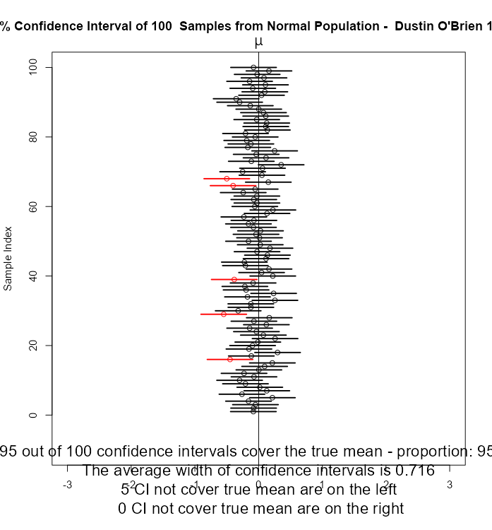

3.  Based on the above results, what is the proportion of confidence intervals covering the true population mean? What is the average width of these confidence intervals? Do the widths of these confidence intervals equal to each other?

    ```         
    95% of the confidence intervals cover the true mean the average width is .716 and all the widths are equal in their size
    ```

4.  Now keep all the other input the same, change the Population Variance Known to "No". Save the plot to the same folder of this R Markdown file (name it as "assignment1_4.png"), and insert that plot below. 

5.  What is the proportion of confidence intervals covering the true population mean? What is the average width of these confidence intervals? Do the widths of these confidence intervals equal to each other? Explain why if there is a difference between 2 and 3.

    `the confidence has been lowered to 94%` and the average width has also increased to .75 the intervals are also now different sizes because they have to gauge the confidence interval on their own variance which can shift instead of the more accurate population variance

**End of Assignment 1**

Next, about the **Confidence Coefficient**

## Assignment 2

1.  Set the Population Distribution as "Normal", Pop Variance Known as "No", Confidence Coefficient as "0.80", Sample Size as "40", Nmber of Samples as "100".

2.  Go to "Confidence Interval - Sample Mean", download the figure and post it below.

    

3.  Based on the result, what is the proportion of CIs that cover the true mean? What is the average width of CIs?

    ```         
    79% of CI's cover true mean and average width is .411
    ```

4.  Repeat question 2,3, but for different confidence coefficients "0.85", "0.90", "0.95", "0.99", respectively.

    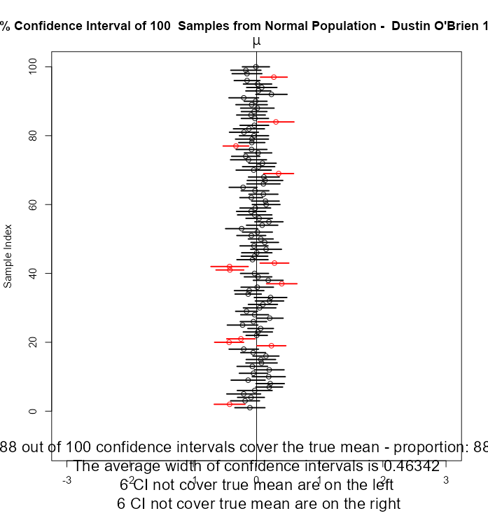

    

    

    

    ```         
    their is as an 88% confidence in the .85 confidence coeffcient with an average width of .46

    their is as an 91% confidence in the .90 confidence coeffcient with an average width of .4

    their is as an 93% confidence in the .95 confidence coeffcient with an average width of .63

    their is as an 93% confidence in the .99 confidence coeffcient with an average width of .64
    ```

5.  Now, based on the above results, use the technique in Part 0, create a table that contains three columns: "Coefficient Coefficient" with values 0.80, 0.85, 0.90, 0.95, 0.99; "Prop of CIs cover True Mean" with values you observed in the previous steps; "Ave Width of CIs" with values you observed in the previous steps. Then add a title "CIs from Normal Pop - Different Confidence Coefficients - Sample Size 40". Present the R codes and the table below:

    ```{r}
    confidence_Coefficient <- c(.85,.90,.95,.99)
    aveage_Width <- c(.46,.4,.63,.64)
    confidence_Intervals <- c(.88, .91, .93, .93)

    CI_table_90_normal <- data.frame(confidence_Coefficient, aveage_Width, confidence_Intervals)
    CI_table_90_normal
    ```

6.  Based on the results on 5, describe how does the proportion of CIs that cover true means, and the average width of CIs changes when confidence coefficient increases? Explain your observations.

    ```         
    as Confidence coesffcient increases so does the confidence interval although perhaps with a rate of decay as it goes +.3 +.2 +0
    ```

**End of Assignment 2**

The next factor we are interested in is the **sample size**.

## Assignment 3

1.  Set the Population Distribution as "Normal", Pop Variance Known as "No", Confidence Coefficient as "0.95", Sample Size as "10", Number of Samples as "100".

2.  Go to "Confidence Interval - Sample Mean", download the figure and post it below.

    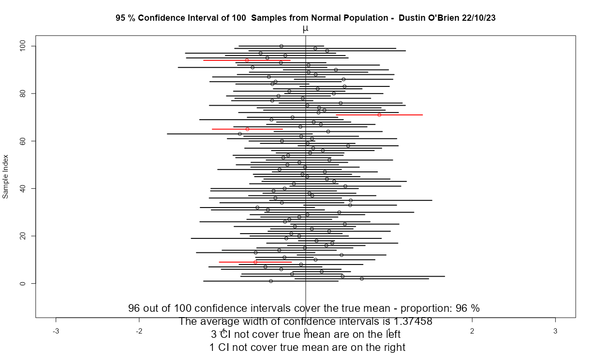

3.  Based on the result, what is the proportion of CIs that cover the true mean? What is the average width of CIs?

    ```         
    the average width is 1.37
    ```

4.  Repeat question 2,3, but for different sample sizes "40", "90", "160", "250", respectively.

    

    

    

    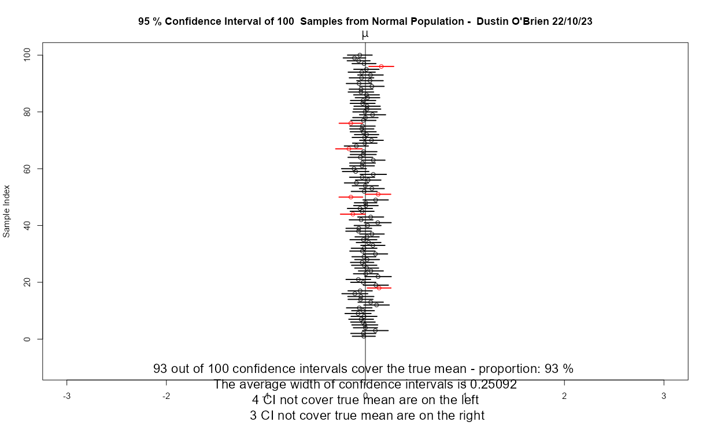

    ```         
     the sample size of 40 has a width of .65
     the sample size of 90 has a width of .41
     the sample size of 160 has a width of .31
     the sample size of 250 has a width of .25
    ```

5.  Now, based on the above results, use the technique in Part 0, create a table that contains three columns: "Sample Size" with values 10, 40, 90, 160, 250;"Prop of CIs cover True Mean" with values you observed in the previous steps; "Ave Width of CIs" with values you observed in the previous steps. Then add a title "95% CIs from Normal Pop - Different Sample Sizes". Present the R codes and the table below:

    ```{r}
    Sample_Size <- c(10,40,90, 160, 250)
    confidence_Proportion <- c(.96, .96,.97,.96, .93)
    avg_Width <- c(1.37, .64, .41, .31, .25)
    CI_table_90_normal <- data.frame(Sample_Size , confidence_Proportion, avg_Width)
    CI_table_90_normal
    ```

6.  Based on the results on 5, describe how does the proportion of CIs that cover true means, and the average width of CIs changes when sample size increases? Explain your observations.

    ```         
    its quite hard to tell with the 5 points of data with the proportion that got it right it seems that their may be a sort of a parabolic relationship betweenthe two given the data but that could alos be noise  for average width though its much more obvious as the relationship is inverted as sample size rises average width falls
    ```

7.  Now, summarize the observations in assignment 2 and 3. When the coefficient coefficient increase, how does the proportion of CIs cover true means and the average width of CIs changes? How about the effect when the sample size increase? Do you prefer settings that has a higher proportion of CIs that cover the true mean? Do you prefer seetings that has a small average CI width? Based on the answers of the above questions, what should you do if you want to maintain a high proportion and a small average CI width at the same time?

    ```         
    the relationship between the cofidence coeffcient rises so does the confidence interval and so does width while in sample size the width decreases and the proportion is uncertain. youll need a large sample size for that last case
    ```

**End of Assignment 3**

# Part II: Effect of Population Distribution

In part I, we have studied the effects of standard deviation used, confidence coefficient, and sample size for **Normal Population Distribution**. As we discussed in the introduction, the theoretic foundation of confidence interval for mean is the **Central Limit Theorem (CLT)**. Recall the assumptions needed for CLT:

1.  The "parent" population has a finite mean $\mu$

2.  The "parent" population has a finite standard deviation $\sigma$

3.  a\. The "parent" population follows a normal distribution (then sample size $n$ doesn't matter), OR

    b\. The "parent" population can be **ANY** distribution, as long as assumptions 1 and 2 are satisfied, and the sample size $n$ is sufficiently large ($n\geq 30$ for most of the cases).

In this part, let's explore the effect of different "parent" distribution to CIs.

We start with small sample size (n=5). Since we are discussing different distribution, we will NOT compare the width of confidence intervals between different distribution. However, we do prefer the widths of CIs remain close to each other within the same distribution (especially when we don't know the population standard deviation and using the sample standard deviation, which is the most common case in practice). In addition, we want to check whether the CIs not covering true mean is balance (i.e., whether there are more not-covering-true-mean CIs lie on the left-hand side (or right-hand side) of the true mean)

## Assignment 4

1.  Set the Population Distribution as "Normal", Pop Variance Known as "No", Confidence Coefficient as "0.80", Sample Size as "5", Number of Samples as "100".

2.  Go to "Confidence Interval - Sample Mean", download the figure and post it below.

    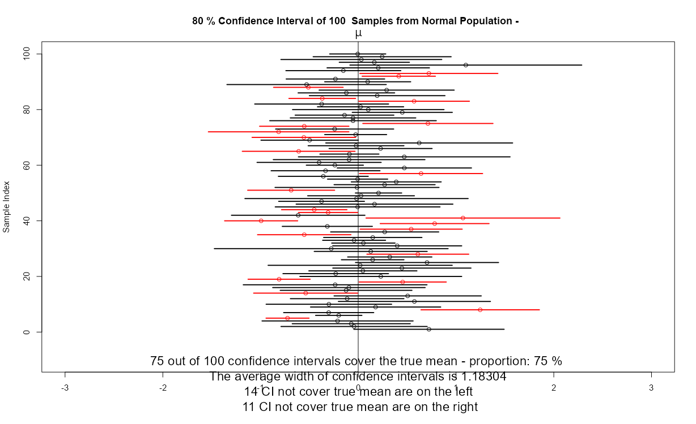

3.  Based on the result, what is the proportion of CIs that cover the true mean? How many CIs not cover true mean on the left? On the right? Are the difference between left and right greater than 5? Are the widths of CIs relatively close to each other?

    ```         
    75% of the Intervals cover the mean their are 14 on the left and 11 on the right so the answer two question 2 is no. depends on definetion of how relative it wqould be but id say so as that aren't any super long ones or super short ones
    ```

4.  Repeat question 2,3, but for different population distributions "Uniform", "Right Stewed", "Left Stewed", "Bimodal", and "Cauchy", respectively.

5.  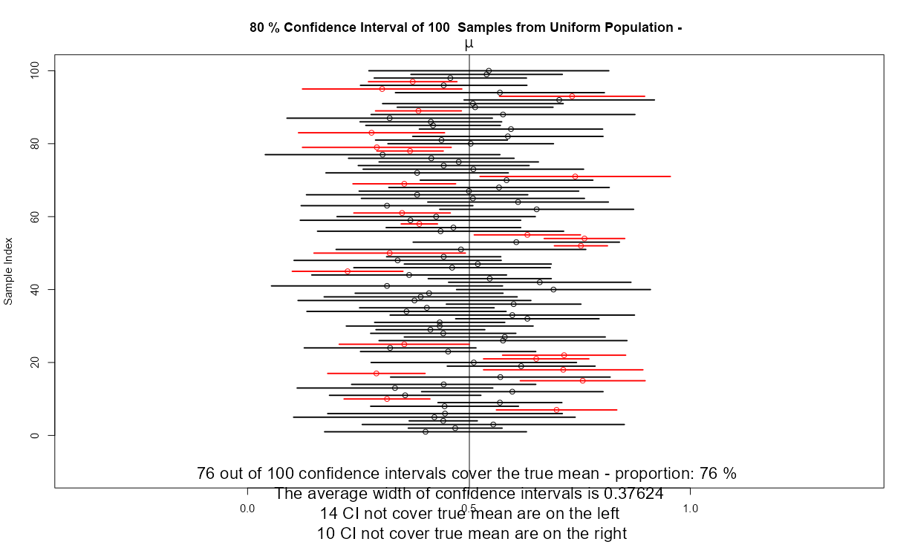   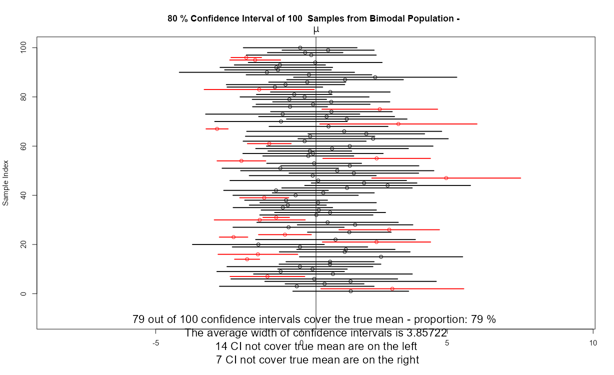 

    ```         
    Uniform - For the uniform population 76% go over the interval and their is only a difference of 3 on one side so it is practically equal however the size here is more dramatic as some come out to be very small intervals relative to Normal

    Right - this data set has a 71% over the interval the intervals are more likely to go to for left and the invterval is less drmatic in difference to Uniform but more than normal

    Left - this data set has 78% going over the mean and generally favors the right when it is off it has a interval size similar to rights

    Bimodal - this data set has a 79% of intervals which include the mean the bumodal distbution seems to go off too the left more than the rightand varies more in interval size

    Caunchy - 76% of population intervals include the mean 20 are on the right 4 on the left so this is clearly Left leaning
    ```

6.  Now, based on the above results, use the technique in Part 0, create a table that contains three columns: "Parent Distribution" with values c("Normal", "Uniform", "Right Stewed", "Left Stewed", "Bimodal", "Cauchy"); "Prop of CIs cover True Mean" with values you observed in the previous steps; "Num of left CI not cover true mean" with values you observed in the previous steps; "Num of right CI not cover true mean" with values you observed in the previous steps.. Then add a title "80% CIs from Different Pop - Sample Size 5". Present the R codes and the table below:

    ```{r}
    Parent_distribution <- c("NORMAL","UNIFORM","RIGHT SKEWED", "LEFT SKEWED", "BIMODAL", "CAUNCHY")
    numonLeft <- c(14, 14, 20, 8, 14, 20)
    numonRight <- c(11, 10, 9, 14, 7, 4)
    CI_table <- data.frame(Parent_distribution , numonLeft, numonRight)
    CI_table
    ```

7.  Based on the results on 5, describe your observations. When the sample size is small, will you trust the results of confidence interval when the you believe the sample data is not from a normal distributed population? Why or why not? (You may want to discussed the different distributions separately)

    (remember you can check the normality using QQ-plot, more details will be discussed in Lab 7)

    ```         
    it seems like it isnt that trust worthy as its always a 70% interval rather than the previously mentioned 90% so I'd absolutlely be skeptical
    ```

**End of Assignment 4**

What if the sample size is large enough?

## Assignment 5

Repeat and answer all questions in steps 1-5 in Assignment 4, but change the sample size to 500. Then answer the question. When the sample size is large, will you trust results of confidence interval when the you believe the sample data is not from a normal distributed population? Why or why not? (You may want to discussed the different distributions separately)

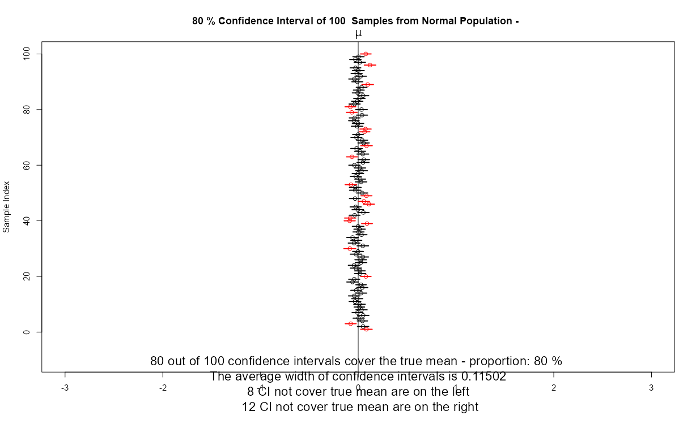 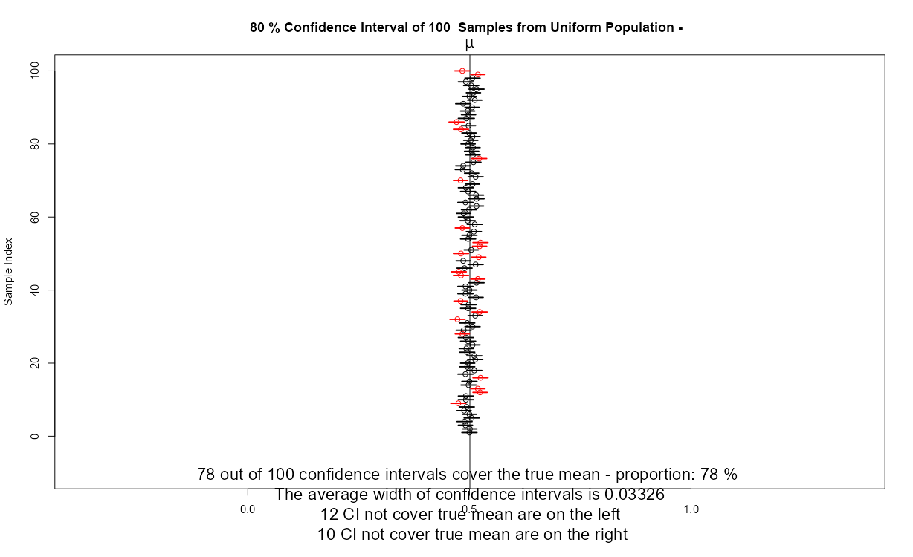   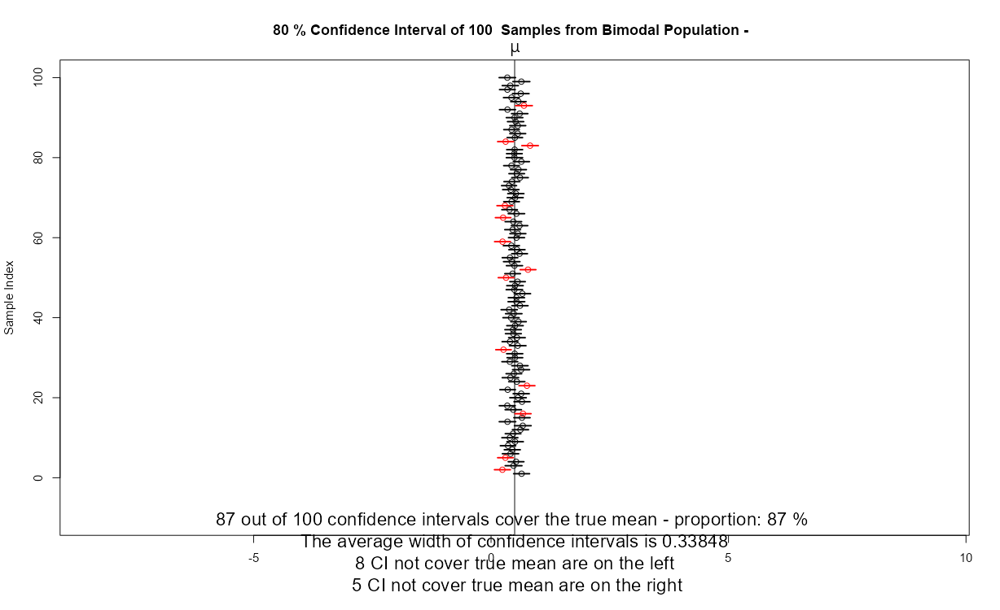 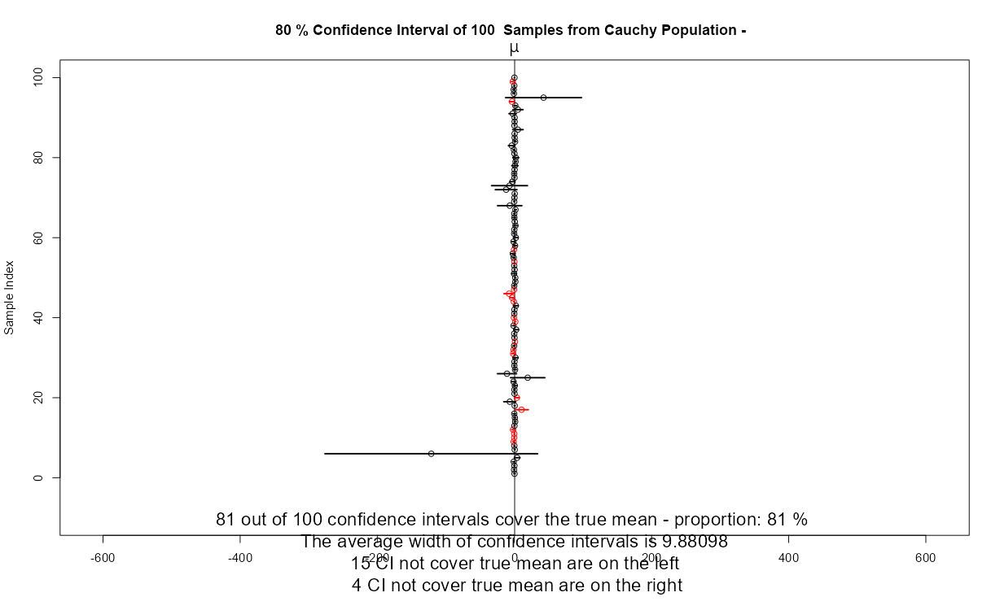

```         
Normal - 80% of the uniforms data goes over the mean the average width is .11 and once again their is not a significant deviation to one side of the mean

Uniform - this time 78% of the intervals cross mean with an average width of .03 this one also doesnt not have a side favored in regards to what side of mean everything is on

Right - this is also 78% in regards of intervals including mean however this time the left is favored as the side of intervals not including mean the width is .07

Left - 81% this data has more on the right that dont get to mean and the width is .02

Bimodal - 87% of intervals include the mean with no major shift although that could be a problem created by high accuracy as now the variance isnt high enough to allow an over 5 difference

Caunchy - 81% of the graph goes over the mean the average width is 9.88 likely due too a few extreme outliers the data is very left ward shifted in regards to where its wrong
```

**End of Assignment 5**

# Part III: Knit this markdown file to a html report

After you complete all the above assignments, click the Knit button to create a html report. Submit that html report.

# Appendix: Define a R Function to Compute CI

Just for your knowledge, not part of this lab. We can define the following R function to compute CI for a given data set or given sample statistics.

```{r}

CI_data <- function(data, PopSDknown, PopSDvalue, ConfCoef, digit ){
  
  # data should be a column of numeric data
  # PopSDknown should be "Yes" or "No", whether the Population standard deviation is known or not.
  # PopSDvalue should be the value of the pop sd value. If pop sd is NOT known, just input 0.
  # ConfCoef is the confidence coefficient, should be a real number between 0 and 1.
  # digit is the number of digits you want to present in the CI
  
  x_bar <- mean(data)
  n <- length(data)
  
  confLv <- ConfCoef*100
  
  if (PopSDknown == "Yes"){
        crval <- qnorm((1+ConfCoef)/2)
        SD <- PopSDvalue
        output1 <- paste("The population standard deviation is", bquote(.(PopSDvalue)))
        
  }
  else if (PopSDknown == "No"){
        crval = qt((1+ConfCoef)/2,n-1)
        SD <- sd(data)
        output1 <- paste("The population standard deviation is unknown.")
  }
  
  ci_ub <- round(x_bar + crval*SD/sqrt(n),digit)
  ci_lb <- round(x_bar - crval*SD/sqrt(n),digit)
  

  
  
  cat(output1,"\nThe sample size is", bquote(.(n)), ". The sample mean is", bquote(.(x_bar)), ". The sample standard deviation is", bquote(.(sd(data))),"\nThe", bquote(.(confLv)), "% Confidence Interval for the population mean is (", bquote(.(ci_lb)), bquote(.(ci_ub)), ").\n" )
  
}


```

Let's try it.

```{r}
x <- rnorm(100,5,3)
CI_data(x,"No",0,0.95,4)


```

```{r}

CI_data(x,"Yes",3,0.95,4)
```

The next one is finding the CI with sample stat given (not the raw data).

```{r}
CI_stat <- function(x_bar,n, PopSDknown, SD, ConfCoef, digit ){
  
  # x_bar is the sample mean
  # n is the sample size
  # PopSDknown should be "Yes" or "No", whether the Population standard deviation is known or not
  # SD is the pop sd or sample sd, depends on the input of PopSDknown
  # ConfCoef is the confidence coefficient, should be a real number between 0 and 1.
  # digit is the number of digits you want to present in the CI
  

  confLv <- ConfCoef*100
  
  if (PopSDknown == "Yes"){
        crval <- qnorm((1+ConfCoef)/2)
        output1 <- paste("The population standard deviation is", bquote(.(SD)))
        
  }
  else if (PopSDknown == "No"){
        crval = qt((1+ConfCoef)/2,n-1)
        output1 <- paste("The population standard deviation is unknown.")
  }
  
  ci_ub <- round(x_bar + crval*SD/sqrt(n),digit)
  ci_lb <- round(x_bar - crval*SD/sqrt(n),digit)

  
  cat(output1,"\nThe sample size is", bquote(.(n)), ". The sample mean is", bquote(.(x_bar)), ". The sample standard deviation is", bquote(.(SD)),"\nThe", bquote(.(confLv)), "% Confidence Interval for the population mean is (", bquote(.(ci_lb)), bquote(.(ci_ub)), ").\n" )
  
}
```

```{r}
CI_stat(4.711773,100,"Yes",3,0.95,4)
```
